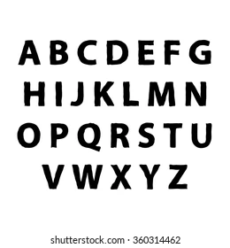

  <h1 style="font-weight: 700; color: #fff">1. Hackathon</h1>

  <h2 style="font-weight: 700; color: #ff0">⚠️ Shartlar</h2>

1. Masalani yechib bo'lganingizdan so'ng kuratorlarni chaqiring!
2. Masalani topshirishdan oldin esa avval yaxshilab tekshiring!
3. Masalani kodini tushunarli qilib yozing
4. O'zgaruvchilarga to'g'ri va o'z vazifasidan kelib chiqib nom bering!

 

  <h2 style="font-weight: 700; color: #f80">💼 Baholash asoslari</h2>

- Yechim uchun maksimum: 1 - 20 ball
- Optimal yechim uchun: 1 - 20 ball
- Kod uchun: 1 - 20 ball
- Nomlash uchun: 1 - 20 ball
- Vaqt uchun: 1 - 20 ball

  

  <h2 style="font-weight: 700; color: #f80">Round 1 😊</h2>

---

Funksiya yarating va u ikkit parametr olsin: `n` va `s`

`n` -> `int` bo'ladi 

`s` -> `str` bo'ladi

Funksiyaning vazifasi esa `s` matnini `n` marta qilib qaytarish

P.S: Funksiya string qaytarishi kerak

### **Example - 1:**

    Input: <code>repeat_text("Hello", 5)</code>
      
    Output: <code>"HelloHelloHelloHelloHello"</code>

 

### **Example - 2:**

    Input: <code>repeat_text("24", 8)</code>
      
    Output: <code>"2424242424242424"</code>

 

### Omad!

   

  <h2 style="font-weight: 700; color: #f80">Round 2 🙁</h2>

Vazifamiz shundan iboratki: matnni ichidan bir xil xarfni topish va uni "1" ga almashtirib qoyish

1. Funksiya yarating va uni nomi 'main()' bolsin :
2. Funksiyamz 'string' dgan parametr olsin 
3. Funksiyamz oxirgi natijani 'return' qilsin

### **Example - 1:**

    Input: <code>main("somsa")</code>
      
    Output: <code>"1om1a"</code>

 

### **Example - 2:**

    Input: <code>main("kuchuk")</code>
      
    Output: <code>"1uchu1"</code>

 

   

  <h2 style="font-weight: 700; color: #f80">Round 3 😢</h2>

EPAM Systems kompaniyasida dasturchi bo'lib ishlayabsiz va sizning jamoangizga `Message encrypter` dasturi ishlab chiqish vazifasi topshirildi…

`Message encrypter` bu →  Xabarni shifrlash ya'ni unga tushunarsiz holga o'girgich va ular odatda alfavit ketma-ketligiga bog'liq bo'ladi. Misol uchun:

Misol uchun :
Salom Otabek → Tbmpn Pubcfl ga o'zgaradi chunki har bir harf bitta o'rin surilayabdi.

Siznin vazifangiz esa xuddi shunday dastur tuzish

### **Example - 1:**

    Input: <code>encrypt_message("Hello")</code>
      
    Output: <code>"Ifmmp"</code>

 

### **Example - 2:**

    Input: <code>encrypt_message("Nima gap")</code>
      
    Output: <code>"Ojnb hbq"</code>

 

**Hint:**

Yuqoridagi rasmda keltirilgan alifbodan foydalaning

katta harf kattaga kichik harf esa kichikga shriflanishi lozim Misol uchun: (HELLO → IFMMP)      (sAlOm → tBmPn)

Agar xabarda bo'sh joy yoki belgi ko'rsangiz ular o'z o'rnida qolaveradi ammo xarflar o'zgarishi kerak.

Bollar biz yutamiz!